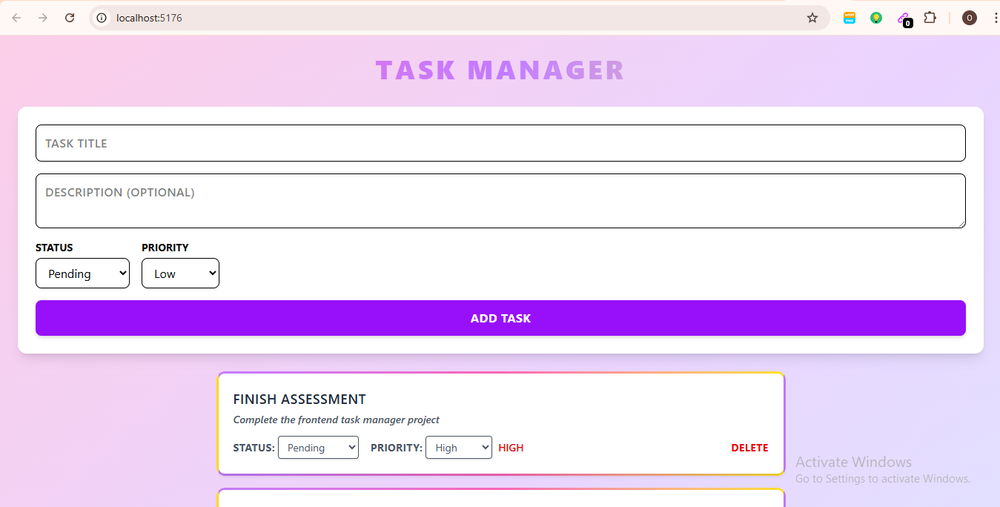

## TASK MANAGER APP (Frontend)
A simple React app to manage tasks with Create, Read, Update, Delete (CRUD) functionality. Uses mock data with localStorage for demonstration.

## INSTALLATION
- git clone <https://github.com/AnjolaDev/task-manager-project.git>
- cd task-manager
- npm install
- npm run dev
- http://localhost:5176/

## MOCK API CONFIGURATION
- The app uses localStorage to store tasks.
- No backend setup is needed.
- Tasks will persist locally and survive page reloads.
- All CRUD operations (create, read, update, delete) are handled in React state and mirrored in localStorage.

## COMPONENTS
App.jsx - Main container; handles task state, CRUD functions, and localStorage integration.
TaskForm.jsx – Form to create new tasks (Title, Description, Status, Priority).
TaskList.jsx – Displays tasks; handles loading and empty states.
TaskItem.jsx – Individual task card; inline editing of status/priority and delete button.

## FEATURES
- List tasks from mock data.
- Add new tasks via form.
- Update status and priority inline.
- Delete tasks with confirmation.
- Persist tasks in localStorage (mock mode).
- Gradient borders, shadows, hover effects, and responsive design.

## NOTES
- Built with React functional components and hooks (useState & useEffect).
- Styled with Tailwind CSS.
- Fully functional in mock mode, no backend required.

## SCREENSHOTS
1. Task Form View

2. Delete Form View

